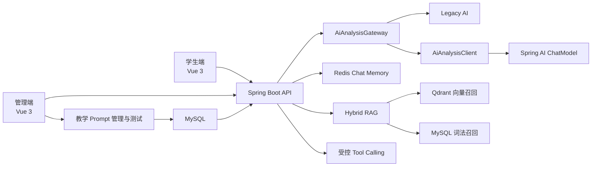

# Master408 AI 学习工作台

> 面向 408 计算机考研场景的 AI 学习与刷题系统。项目在既有题库、考试、学习记录和管理后台基础上进行增量升级，重点探索 Spring AI 在真实 Java 业务中的工程化落地，而非重新实现一套聊天 Demo。

## 项目简介

Master408 原有系统已经具备题库、试卷、错题、知识点和用户学习记录等完整业务能力。本项目大量复用这些成熟资产，并将后端升级至 Java 21、Spring Boot 4.1 和 Spring AI 2.0，在不破坏原有业务的前提下逐步加入：

- 供应商无关的模型调用边界；
- 同步与 SSE 流式回答；
- 按用户和会话隔离的 Redis 对话记忆；
- 面向 408 知识库的 RAG 检索；
- 受控的 Tool Calling；
- 可配置、可测试和可追溯的教学 Prompt；
- 管理端模型配置、用量统计和教学策略测试。

项目关注的不只是“模型能否回答”，还包括兼容迁移、数据契约、故障回退、密钥安全、运行时治理以及后续扩展成本。

## 核心能力

### AI 学习工作台

- 支持题目粘贴、知识目录选择和学习上下文组合；
- 支持同步回答与 SSE 流式输出；
- 提供苏格拉底式教学 Prompt，引导用户逐步思考；
- 支持运行时引擎标识和会话记忆清理；
- 根据用户、业务场景和会话生成隔离的 Memory ID，防止上下文串话。

### 模型接入与兼容迁移

- 使用 Spring AI `ChatModel` 统一基础模型能力；
- 通过自定义 `AiAnalysisClient` 隔离上层业务与具体 AI 框架；
- 使用 `AiAnalysisGateway` 统一路由 Legacy 与 Spring AI 实现；
- 保留 Legacy 回退路径，可通过配置切换引擎，降低一次性迁移风险；
- 支持从环境变量或数据库加载模型供应商配置，密钥不返回前端。

### RAG 与工具调用

- 使用 Spring AI VectorStore 抽象对接 Qdrant；
- 使用 MySQL ngram 全文索引提供本地中文词法召回；
- 通过带权 RRF 融合向量/词法候选，再按查询覆盖和证据分数确定性重排；
- Qdrant 不可用时自动保留本地词法链路，不依赖额外重排模型；
- 检索运行、候选分数、来源位置和回答实际使用的引用均可追溯；
- Tool Calling 采用“规划—确认—执行”模式，写操作不由模型直接触发；
- 当前工具覆盖学习画像、知识点检索及受控组卷等业务场景。

### 教学 Prompt 管理与测试

- Prompt 定义与版本分离；
- 草稿、提交、审批、灰度、全量发布和回滚；
- 发布前变量校验与测试；
- 基于稳定哈希的用户灰度；
- Kill Switch 和代码兜底 Prompt；
- 管理端提供版本 Diff、在线测试和发布操作入口；
- 当前管理的是教学 Prompt 与发布策略，不将其包装为包含工具、流程和权限的完整 Skill 平台。

### 评测、可观测与稳定性

- 内置版本化原创固定评测集，比较 Prompt 质量、估算 Token/成本和端到端延迟；
- 管理端可异步运行真实模型评测、查看逐条证据并比较同版本数据集的两个候选；
- 同步 Spring AI 调用读取供应商真实 Usage，缺失时明确标注为 estimated；
- requestId 串联用户、会话、模型、Prompt 发布版本、费用、耗时和用户反馈；
- 应用边界提供并发舱壁、速率调度、瞬时错误重试、429 退避、熔断和供应商降级；
- 流式响应首 Token 后禁止重放，避免重试产生重复正文。

## 系统架构



## 技术栈

| 分层 | 技术 |
| --- | --- |
| 后端 | Java 21、Spring Boot 4.1、Spring AI 2.0 |
| 数据访问 | MyBatis、MySQL、Flyway |
| AI 基础设施 | ChatModel、VectorStore、Tool Calling、SSE |
| 状态与检索 | Redis、Qdrant |
| 前端 | Vue 3、Vite、Element Plus、Pinia、ECharts |
| 测试 | JUnit 5、Spring Boot Test、Mock ChatModel |

## 工程化改造

本项目没有采用“大版本直接重写”的方式，而是按兼容边界分段迁移：

1. 复用原系统领域模型、Mapper、Service、Controller、Prompt 和前端 API 契约；
2. 按 Spring Boot 2.7 → 3.5 → 4.1 完成 Jakarta、Security、Jackson、MyBatis 等兼容升级；
3. 使用 Flyway 固化数据库结构，并通过数据库契约测试同时检查缺表、多表和关键字段；
4. 在控制器与模型实现之间加入 Gateway 和 Client 边界；
5. 通过配置开关、小流量灰度和 Legacy 回退逐步迁移 AI 链路；
6. 使用 Mock 模型完成隔离测试，避免单元测试依赖外部大模型的费用和稳定性。

更多运行与模块说明见：

- [后端说明](apps/backend/README.md)
- [前端说明](apps/frontend/README.md)
- [功能规格与路线图](specs/sdd.md)
- [面试准备资料导航](面试资料/README.md)

## 目录结构

```text
master408v2/
├─ apps/
│  ├─ backend/
│  │  └─ backend-app/       # 主应用、AI 能力与数据库迁移
│  └─ frontend/
│     ├─ student/           # 学生端，默认端口 8001
│     └─ admin/             # 管理端，默认端口 8002
├─ specs/                   # Feature 规格、验证与自我考核
├─ docs/                    # 工程事实、技术债与历史记录
├─ 面试资料/                # 学习手册、项目复盘与面试题
├─ README.md
└─ .gitignore
```

## 本地运行

### 环境要求

- JDK 21
- Maven 3.9+
- Node.js 20+
- MySQL 8
- Redis
- Qdrant（仅向量 RAG 需要）
- 一个兼容 OpenAI 协议的模型服务（启用 Spring AI 实际调用时需要）

### 1. 配置本地环境

敏感配置请通过进程环境变量提供，不要写入仓库。若保存在本地忽略的 `.env`，
必须先由启动工具加载到进程环境；下面的 Maven 命令不会自动读取该文件。
先确认 `java -version` 为 21，并让 `JAVA_HOME` 指向本机 JDK 21。
数据库 URL 必须显式指定：应用默认库为 `xzs`，下例使用独立的 `master408_v2`，不要混淆。

```powershell
$env:DB_URL='jdbc:mysql://127.0.0.1:3306/master408_v2?useUnicode=true&characterEncoding=utf8&serverTimezone=Asia/Shanghai'
$env:DB_USERNAME='root'
$env:DB_PASSWORD='<your-password>'

$env:REDIS_HOST='127.0.0.1'
$env:REDIS_PORT='6379'

# 默认使用 Legacy 链路；启用 Spring AI 时再设置以下变量
$env:AI_ENGINE='spring'
$env:AI_PROVIDER_SOURCE='environment'
$env:SPRING_AI_CHAT_MODEL='openai'
$env:AI_CHAT_API_KEY='<your-api-key>'
$env:AI_CHAT_BASE_URL='<openai-compatible-base-url>'
$env:AI_CHAT_MODEL='<model-name>'
```

仅运行普通业务时可不启用 Spring AI。环境配置模式还会装配独立 EmbeddingModel，
需设置有效的 `AI_EMBEDDING_API_KEY`、`AI_EMBEDDING_BASE_URL`、`AI_EMBEDDING_MODEL`，
不要把仅支持对话的服务地址当成向量服务。数据库供应商配置模式则使用
`AI_PROVIDER_SOURCE=database`，并配置对应数据库记录与解密主密钥。

若本地配置启用了 `AI_RAG_VECTOR_ENABLED=true`，先启动 Qdrant 并确认 gRPC 端口可达；
向量组件初始化时不可连接可能阻止后端启动。“检索时单路降级”不等于“启动不需要 Qdrant”。

完整数据库结构由 Flyway 管理，首次启动时会执行：

- `V1__baseline.sql`
- `V2__prompt_ops_control_plane.sql`
- `V3__ai_evaluation_baseline.sql`
- `V4__ai_observability_chain.sql`
- `V5__rag_hybrid_retrieval.sql`

Flyway 文件只负责结构和 PromptOps 必要配置，不包含原题库。需要最小演示数据时，
可在 Flyway 完成后手动导入原创示例：

```powershell
mysql -u root -p master408_v2 --execute="source apps/backend/backend-app/src/main/resources/db/demo/01_demo_seed.sql"
```

### 2. 启动后端

```powershell
mvn -f apps/backend/backend-app/pom.xml spring-boot:run
```

后端默认地址：`http://127.0.0.1:8003`

### 3. 启动学生端

```powershell
cd apps/frontend/student
npm ci
npm run serve
```

学生端默认地址：`http://127.0.0.1:8001`

### 4. 启动管理端

```powershell
cd apps/frontend/admin
npm ci
npm run dev
```

管理端默认地址：`http://127.0.0.1:8002`

## 测试

后端测试覆盖应用上下文、数据库结构契约、模型路由、同步与流式委托、Prompt
解析、会话隔离、固定评测、真实 Usage、反馈归属、稳定性策略、混合 RAG、
Tool Calling 和教学 Prompt 状态流转。

```powershell
mvn -f apps/backend/backend-app/pom.xml test
```

多数 AI 测试使用 Mock ChatModel，不会调用真实模型。数据库契约测试和 Redis 集成测试需要相应的本地基础设施。

历史运行数据已归档到 [2026-07-28 评测与稳定性记录](面试资料/项目复盘/2026-07-28-评测与稳定性记录.md)。
这些数字是当时的小样本记录，不代表当前提交的全量测试结果或生产容量；本次文档整理未重跑测试。

## 安全说明

- API Key、数据库口令、Redis 口令和主密钥只能来自环境变量或本地忽略配置；
- 管理端接口需要管理员权限；
- 用户模型密钥加密存储，接口只返回脱敏信息；
- Prompt 草稿不能直接进入生产流量；
- 模型生成的工具参数必须经过后端权限和参数校验；
- 仓库不应包含真实用户数据、个人简历、聊天记录或内部培训资料。
- 原题库、解析、爬虫知识页和图片不随开源仓库分发；仓库仅提供原创 Demo Seed。

如果密钥曾经进入 Git 历史，仅删除文件或补充 `.gitignore` 并不能消除泄露风险，应先轮换密钥并清理历史。

## 当前边界与后续计划

已经完成的主链路包括 Spring AI 接入、Legacy 回退、流式响应、Redis 会话记忆、
受控工具调用、教学 Prompt 管理与测试、固定评测、统一可观测、调用稳定性和混合 RAG。

这里描述已有实现，不代表作者已通过全部自我考核，也不意味着当前提交已重新全量验收。
管理端整体重建与特殊格式题目的展示/RAG 数据契约仍在规划设计中，以 [roadmap](specs/roadmap.md)
及各 Feature 的 validation 为准。

当前边界：

- 流式 Token 在部分 OpenAI 兼容厂商下没有最终 Usage，因此使用 estimated；
- 本地确定性重排成本低且稳定，但不等同于 Cross-Encoder 语义重排；
- 调用预算目前是单应用实例级；多实例部署应将配额和熔断状态迁移到网关或 Redis；
- 用户反馈 API 已建立，学生工作台的评分交互仍可继续完善；
- 仍需处理前端历史依赖的安全升级与更大规模压测。

完整技术决策和失败测试见 [AI 工程演进记录](docs/AI工程演进记录.md)。

## 项目来源与许可

本项目基于既有开源考试系统进行学习和二次开发，复用了其部分业务代码与前端结构。公开部署或二次分发前，请同时遵守上游项目许可及相关依赖的许可证要求。

项目仍在持续整理中。题库、解析、图片、字体及其他第三方资源只有在确认拥有公开授权后才应进入公开仓库。
