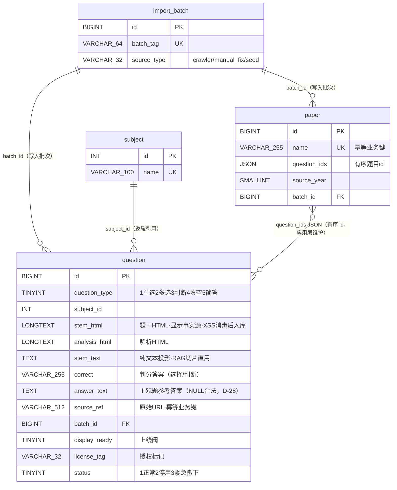

# 新库 ER 说明（v0，D-33 raw 极简）

配套脚本：[`ddl/newdb-v0.sql`](ddl/newdb-v0.sql)（可直接执行建库）。
日期 2026-09-30；依据 `requirements.md` D-33/D-30/D-22/D-28、plan 重开定向、
2026-09-24～27 讨论收敛（98% 纯文字实测、语料完好、无人工编辑、写入=批次导入）。

## 1. 范围与定位

v0 覆盖**题目域 + 试卷域 + 导入血缘**（3 张业务表 + 1 张血缘表）。
这是 9-20 设计收敛后的最小可用库：爬虫 → `import_batch` → `question` → 组卷 `paper`，
RAG 从 `question.stem_text` 取切片文字。**应用能跑的完整库**还需作答域与用户域——
它们未经讨论设计，见「刻意缺席」，实施时按需以同样的 prune 原则从旧结构引入。

## 2. ER 图



## 3. 设计决策对照（为什么是这个形状）

| 决策 | 内容 | 依据 |
| --- | --- | --- |
| **HTML 为内容事实源** | `stem_html`/`analysis_html` 直存爬取原文（消毒后），显示与 RAG 文本都从它派生 | D-33：语料完好（98% 纯文字实测），转换层才是病灶（TD-017 截断） |
| **无版本机器** | 不建 `question_content`、无 version/current/生成列/乐观并发 | D-31 无人工编辑，写入=批次导入；历史一致性由**作答时快照**承担（作答域实现时落） |
| **无 deleted 列** | 状态单列 `status`（1 正常/2 停用/3 紧急撤下） | 旧库 `deleted`+`status` 双字段是混乱源之一；新库一个字段表达三态 |
| **无独立内容表** | 内容直存 `question`，不设 `t_text_content`/`info_text_content_id` 间接层 | 间接层是多源拼凑（7.2 现状差距）的根源 |
| **投影列只留一个** | `stem_text`（RAG 切片直用）；`analysis_text` 等不再物化 | D-33：派生物必须可从 raw 重建；需要时随时重算 |
| **试卷 = 名 + 有序 id** | `paper.question_ids` JSON 直存，删 `frame_text_content_id` 间接层 | 作者设计（2026-09-27）；试卷本来就只是有序题目列表 |
| **血缘三件套** | `source_ref`（哪来的）+ `batch_id`（哪次写的）+ `license_tag`（授权） | D-30/D-32；`uk_question_source_ref` 使重爬幂等 |
| **上线阀** | `display_ready`：缺 `correct`（纪律 2）或未消毒的题不上线 | 公网安全与判分正确性 |
| **FULLTEXT ngram** | `ft_question_stem_text`——词法检索开箱即用 | D-30 AI 友好；RAG 词法召回不再依赖旧投影列 |

## 4. 刻意缺席（表 → 原因 → 储备指针）

| 表 | 为什么不建 | 何时回来 |
| --- | --- | --- |
| `question_content` 及版本机器 | 版本机器在无人工编辑下空转（D-31） | **储备**：恢复人工编辑时按 D-13~D-17 启用 |
| `content_blocks`（候选 7） | 只服务 ~156 道图题；v1 用不上 | **储备**：检索数据证明图题结构化有必要时（届时 3.9 契约=图纸） |
| `question_asset` / 图提取 | v0 图内联 HTML 渲染即可；提取属导入器升级 | RAG 数据证明需要图描述时（D-32 讨论存档） |
| `question_source` | 来源三列已内联 `question`（source_name/year/question_no/ref） | 不回来——独立表是过度设计 |
| `rag_document/chunk/embedding/answer_citation/retrieval_log` | 可重建投影（D-08），Phase 4/5 按黄金集需要建 | Phase 4/5 |
| 作答域（`exam_answer` 等） | 未讨论设计；衔接点 = **作答时快照题面+答案**（D-17 替代机制） | 实施时按 prune 原则从旧结构引入 |
| 用户/消息/任务/学习画像/知识库/PromptOps 域 | 未在本 Feature 范围 | 实施时按需引入 |
| `t_essay_question` | 98 行从未填充的空壳（U-11 已判） | 不回来 |

## 5. 血缘、纪律与数据流

```
csgraduates.com ──爬取──▶ import_batch(batch_tag)
                              │ batch_id
                              ▼
        question（stem_html/analysis_html 原文 + stem_text 投影
                  + correct/answer_text + license_tag + display_ready）
                              │ question_ids JSON（有序）
                              ▼
                           paper
RAG：stem_text(+answer_text) → chunk → embedding     ← 全文字，图不进向量（合理）
```

三纪律（建库脚本头部同文）：① XSS 消毒强制；② `answer` 校验（type 1/2/3 缺 `correct` → `display_ready=0`）；
③ raw 不可变——内容更新 = 整行替换 + 新 `batch_id`，派生物永远可重建。

## 6. 与旧结构对照（关键差异）

| 项 | 旧库 | 新库 v0 |
| --- | --- | --- |
| 题目内容存放 | `t_question` 8 列冗余 + `t_text_content` JSON（截断 TD-017）+ 文件池三处并存 | `stem_html`/`analysis_html` 一处（raw）+ `stem_text`（派生） |
| 题目↔内容关联 | `info_text_content_id` 间接指针 | 直存，无间接层 |
| 试卷题目列表 | `frame_text_content_id` → JSON | `paper.question_ids` 直存 |
| 状态 | `deleted` + `status` 双字段 | `status` 单列三态 |
| 答案 | `correct` varchar(255)（简答 100% 空） | `correct`（选择判分）+ `answer_text`（主观参考答案，NULL 合法 D-28） |
| 治理 | 无血缘、无授权、无上线阀 | `source_ref`/`batch_id`/`license_tag`/`display_ready` |
| 题号类型 | `source_question_no` int（非数字题号无法表达） | varchar(50) |
