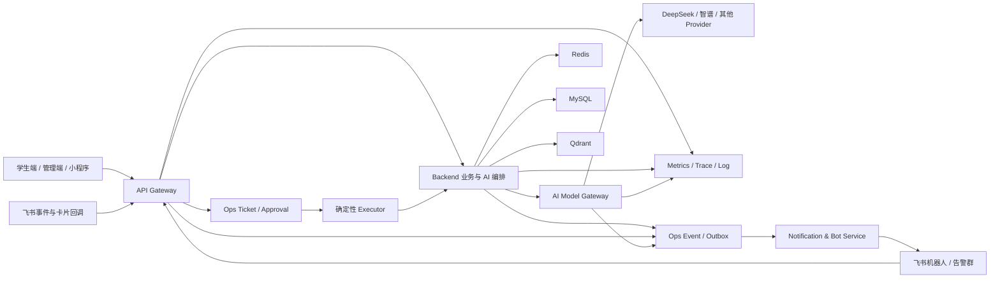

# 408Master 管理员端 AI 运维升级计划

## 1. 建设目标

把现有管理员端从“密钥配置页”升级为 AI 控制平面（AI Control Plane），覆盖：

> 配置 → 测试 → 评测 → 审批 → 发布 → 观测 → 告警 → 回滚

重点不是制作大屏，而是让每次 Prompt、模型、RAG 和工具变更都有版本、有证据、可追踪、可恢复。

目标形态进一步扩展为：

- **管理员控制平面**：配置、评测、发布、观测和工单；
- **API 网关服务**：统一入口、身份边界、Trace、边缘限流与路由；
- **AI 模型网关**：Provider 选择、能力校验、配额、重试、熔断与降级；
- **事件与通知中心**：把用户反馈、告警、发布和故障转换为统一事件；
- **飞书机器人**：通知、查询、认领和发起审批，不绕过内部授权执行高风险动作。

## 2. 当前基线与真实缺口

### 已有能力

- 管理端已有 AI Provider 配置、连通性测试和用量页面；
- 后端已有 Prompt 模板 CRUD、单题测试、审批日志接口；
- `t_ai_usage_log` 已有模型、Token、成本、耗时和错误等字段；
- `ai_run_log` 已记录 Tool Calling 的参数、结果、耗时和状态；
- 已有 RAG 索引、搜索接口及 MySQL/Qdrant 元数据；
- 已有 Actuator 健康检查和部分 Micrometer 指标。

### 首要问题

1. **Prompt 管理与真实运行时断开**  
   管理 API 操作数据库模板，但当前 `AnalysisService` 仍在启动时读取 JSON 文件。管理员修改模板不代表线上生效。

2. **模板是可变记录，不是不可变版本**  
   直接更新一行无法可靠比较、灰度和回滚，也不能回答“某次错误响应使用了哪个版本”。

3. **测试不等于评测**  
   当前单题测试没有固定数据集、基线、评分规则和回归门槛。

4. **日志分散**  
   模型日志、Tool 日志、RAG 状态和 JVM 指标没有统一请求追踪 ID，无法还原一次请求的完整链路。

5. **RAG 建索引仍是同步管理接口**  
   缺少任务状态、进度、取消、失败重试、索引版本和 alias 切换。

6. **缺少发布安全机制**  
   暂无 RBAC 细分、双人审批、灰度比例、Kill Switch 和一键回滚。

## 3. 目标页面结构

```text
AI 运维中心
├── 总览
│   ├── 请求量、成功率、p95、首 Token 延迟
│   ├── Token、成本、429、超时、降级
│   └── 当前发布版本与活动告警
├── Prompt Studio
│   ├── 模板与不可变版本
│   ├── 分层编辑、变量校验、版本 Diff
│   ├── Playground 对照测试
│   └── 审批、灰度、发布、回滚
├── 评测中心
│   ├── 数据集与案例
│   ├── 基线/候选批量运行
│   └── 教学质量、安全、成本和延迟报告
├── 模型与配额
│   ├── Provider 健康、能力和优先级
│   ├── 速率、并发、429 和熔断状态
│   └── 模型降级策略
├── RAG 运维
│   ├── 文档、Chunk、索引版本与覆盖率
│   ├── 检索 Playground
│   └── 异步重建、校验、切换与回滚
├── Tool / Agent
│   ├── 工具白名单、风险等级和超时
│   ├── 调用记录、失败率和幂等结果
│   └── 写操作审批记录
├── 链路与告警
│   ├── Trace 查询与脱敏详情
│   ├── 告警规则、事件和确认
│   └── 故障时间线
├── 用户反馈
│   ├── 点赞/点踩、分类、状态和负责人
│   ├── 关联 Trace、Prompt、模型、RAG 和 Tool
│   └── 聚类、趋势、回归案例和飞书通知
├── 网关中心
│   ├── 路由、QPS、在途请求和状态码
│   ├── 用户/IP/接口边缘限流
│   └── 模型配额、429、熔断与降级
├── 通知与机器人
│   ├── 飞书目标群、规则、静默和升级
│   ├── 发送记录、重试和死信
│   └── 机器人命令与卡片操作审计
└── 审计中心
    ├── 配置变更
    ├── 发布与回滚
    └── 高风险操作审批
```

## 4. 总体架构



### 组件边界

| 组件 | 应做 | 不应做 |
|---|---|---|
| API Gateway | 路由、Trace、粗粒度鉴权、边缘限流、状态码与流量指标 | 读取完整 Prompt、记录模型正文、代替业务权限 |
| Backend | 用户权限、教学业务、Prompt/RAG/Tool 编排 | 在各处直接发送飞书 Webhook |
| AI Model Gateway | 模型能力路由、Key 配额、在途并发、429、熔断和降级 | 代替 API Gateway 管理外部用户流量 |
| Event Center | 事件落库、去重、聚合、静默、升级和投递状态 | 把飞书是否发送成功绑进用户请求事务 |
| Feishu Bot | 通知、只读查询、认领和审批入口 | 直接重启、回滚、删缓存或重建索引 |

## 5. 分阶段实施

## P0：运行时配置统一

**目的**：先消除“面板配置不生效”。

- 建立 `PromptRegistry`，运行时只通过该接口获取 Prompt；
- JSON 仅作为初始化 seed 和数据库不可用时的只读安全兜底；
- 运行日志必须记录 `promptKey + versionId + releaseId`；
- 统一公共 Guardrail、教学风格、任务和模型适配片段的组合顺序；
- 缓存已发布版本，数据库异常时继续使用最后一次成功快照；
- 禁止直接编辑活动版本。

**验收**：

- 管理员发布候选版本后，新请求记录新版本 ID；
- 回滚后新请求立即恢复旧版本；
- 数据库临时不可用时不影响已发布 Prompt 的读取；
- 未发布草稿永远不能进入学生流量。

## P1：Prompt Studio 与安全发布

**后端数据模型建议**：

- `ai_prompt_definition`：Prompt 的稳定业务标识；
- `ai_prompt_version`：不可变内容、变量 schema、模型参数、创建人；
- `ai_prompt_release`：环境、版本、灰度比例、状态和发布时间；
- `ai_prompt_audit_log`：创建、审批、发布、回滚及原因。

状态机：

```text
draft → testing → awaiting_approval → canary → active → retired
                                      ↘ rejected
active → rolled_back
```

**前端能力**：

- system、task、context policy、style、guardrail 分区编辑；
- 必填变量、未知变量、长度和模板渲染校验；
- 当前版本与候选版本 Diff；
- 同题、同模型、同参数的 A/B Playground；
- 发布前填写变更原因、风险和回滚目标；
- 灰度比例只能从 0% 逐步提升，支持 Kill Switch。

**建议**：开发阶段也保留审批状态，但可以由单管理员审批；不要为了展示而伪造多人组织流程。

## P2：教学 Prompt 评测中心

首批固定场景：

- 正确回答、部分正确、典型误区；
- 完全偏题、学生疲劳、“我不会”、明确要求答案；
- “这道题”“刚才说的”之类指代；
- 同会话记忆与跨会话隔离；
- RAG 无结果、错误资料和资料冲突；
- Prompt 注入、索要系统提示、越权写操作。

评分维度：

- 事实正确性；
- 是否识别学生状态；
- 是否指出具体误区；
- 追问是否自然且一次只推进一个动作；
- 答案揭示是否符合规则；
- 上下文和引用是否正确；
- 安全性；
- Token、成本、首 Token 延迟和总耗时。

评分来源应组合使用：

- 可确定规则：格式、问号数、引用、敏感词、工具权限；
- 标准答案或业务断言；
- 人工 Rubric；
- LLM-as-Judge 仅作辅助，并固定 Judge 模型和版本。

**发布门槛示例**：

- 关键安全案例 100% 通过；
- 总体质量不低于基线；
- 典型误区识别率提升；
- p95、Token 和成本不超过预设预算；
- 失败案例可下钻到 Prompt、模型、RAG 和 Tool 记录。

## P3：统一可观测性与链路详情

每次请求生成 `traceId`，贯通：

```text
用户请求
→ 意图路由
→ Prompt 版本
→ Memory
→ RAG 检索
→ 模型调用/重试/降级
→ Tool Calling
→ SSE 完成或断开
```

核心指标：

- 流量：QPS、并发、SSE 在途数；
- 性能：TTFT、p50/p95/p99、总耗时；
- 稳定性：成功率、429、超时、重试、熔断和降级；
- 成本：输入/输出/缓存 Token、单次及每日成本；
- RAG：召回耗时、空结果率、TopK 分数、引用率；
- Tool：调用率、失败率、超时、幂等命中和人工确认率；
- Prompt：各版本流量、评测分、用户反馈和回滚次数。

**安全要求**：

- 默认不展示完整用户输入、Prompt 和模型回复；
- 密钥永不回传；
- 用户信息、订单类参数和 Tool 结果按字段脱敏；
- 完整内容查看需要更高权限并写审计日志；
- 日志设置保留期和删除策略。

## P3.5：API 网关服务

新增独立 `apps/gateway`，建议使用与当前 Spring Boot/Spring Cloud 兼容矩阵对应的 Spring Cloud Gateway Server WebFlux。

第一阶段职责：

- 统一 `/api/student/**`、`/api/admin/**`、`/api/wx/**` 和 `/integrations/**` 路由；
- 生成或透传 `traceId`，禁止信任外部伪造的内部身份头；
- 按 IP、认证用户、接口和业务等级执行边缘限流；
- 设置请求体上限、上传类型、超时和安全响应头；
- 输出路由、状态码、耗时、在途请求和限流指标；
- 保证 SSE 不缓存、不聚合，单独配置连接/响应超时并验证客户端断开释放资源；
- Actuator Gateway 端点默认只读且仅管理员网络/身份可见。

渐进迁移建议：

1. 当前 Session 鉴权仍由 Backend 做最终裁决；
2. Gateway 先负责匿名流量保护和 Trace；
3. 若以后迁移 JWT，Gateway 可验证 Token，但 Backend 仍保留资源级授权；
4. 不为了“微服务”一次拆出多个业务服务。

网关验收：

- 绕过 Gateway 的 Backend 端口在部署网络中不可公网访问；
- SSE 连续输出正常，中文、事件边界和断线处理不回归；
- 网关限流返回明确 429，且不消耗上游模型配额；
- 网关重启或 Redis 限流异常有明确 fail-open/fail-closed 策略；
- 压测保留吞吐、p95/p99、拒绝率、连接数和资源占用。

## P4：模型配额、稳定性与告警

与主计划 M8 联动：

- 面板显示 RateLimiter、Bulkhead、队列和 Redis 共享配额状态；
- 按 Provider、模型、Key 来源和业务类型展示429；
- 配置能力矩阵：流式、视觉、Embedding、Tool Calling；
- 降级策略必须校验能力兼容，不能把 Tool 请求降到不支持工具的模型；
- 告警覆盖 429 激增、p95 超标、错误率、成本异常和 Provider 不可用；
- 告警要有事件、确认、恢复时间，不能只弹一次 Toast。

注意：API Gateway 的用户流量限流与 AI Model Gateway 的供应商配额保护必须同时存在。前者防止单个用户或接口冲击系统，后者防止多个业务入口共同耗尽同一 Provider/Key。

## P5：RAG 与 Tool/Agent 运维

### RAG

- 建索引改为异步 Job；
- 展示待索引、成功、失败、最大 Chunk、模型和维度；
- 新索引写入新 collection/version，校验后切换 alias；
- 切换失败或召回回归时可以恢复旧 alias；
- 检索 Playground 同时展示 query、过滤条件、分数、正文片段和来源。

### Tool / Agent

- 工具分为只读、可逆写、不可逆写三个等级；
- 每个工具配置超时、最大结果大小和是否要求确认；
- 写操作保留业务鉴权、幂等键和审计，不依赖 Prompt 保证安全；
- 面板可停用工具，但不能绕过代码级白名单；
- 展示模型提出的参数、应用实际执行参数和最终结果，三者不可混为一条日志。

## P6：受监督运维 Agent

最后再接主计划 M7：

- Agent 只读取健康、指标、日志和脱敏配置；
- 输出带证据的诊断报告和建议；
- 重建索引、清缓存、切换模型等操作只生成工单；
- 人工审批后由确定性 Executor 执行；
- 结果、失败和回滚写入同一故障时间线。

没有可靠指标、权限和审计前，不应先做“自动修复 Agent”。

## P7：事件中心、用户反馈与飞书机器人

### 7.1 为什么不能直接调用 Webhook

业务线程直接发送飞书消息会带来：

- 飞书超时拖慢用户请求；
- 同一故障产生消息风暴；
- 投递失败不可追踪；
- 无法静默、聚合、升级和审计；
- Webhook 泄露后难以控制权限。

采用 Transactional Outbox：

```text
业务事务写状态 + ops_event/outbox
→ Notification Worker 异步消费
→ 规则匹配、去重、聚合和静默
→ 飞书投递
→ delivery 记录成功/重试/死信
```

核心表建议：

- `ops_event`：事件类型、来源、严重级别、traceId、资源和脱敏载荷；
- `ops_notification_rule`：匹配条件、目标群、静默窗口和升级策略；
- `ops_notification_delivery`：渠道、外部消息 ID、尝试次数和错误；
- `ops_incident`：故障状态、负责人、时间线、根因和恢复结果；
- `ops_ticket`：建议动作、风险、审批、执行和回滚；
- `ai_user_feedback`：评分、分类、说明、traceId、处理状态和是否进入评测集。

投递幂等键建议使用：

> `eventId + channel + target`

### 7.2 用户反馈闭环

学生端为每次 AI 回复增加：

- 点赞/点踩；
- 分类：事实错误、没理解问题、追问生硬、引用错误、太啰嗦、工具失败、其他；
- 可选文字反馈；
- 自动关联 `traceId`，后台再关联 Prompt 版本、模型、RAG 引用和 Tool 记录。

处理流程：

```text
反馈提交
→ 脱敏落库
→ 相似反馈聚类/计数
→ 达到阈值或安全类反馈立即建事件
→ 飞书卡片通知
→ 管理员认领、标注根因
→ 选入评测集
→ Prompt/代码修复
→ 回归通过
→ 发布并关闭反馈
```

普通点踩不逐条轰炸飞书，应按 Prompt 版本/问题类型聚合；越权、隐私泄露和危险写操作等安全反馈立即升级。

### 7.3 告警分级和飞书策略

| 等级 | 示例 | 飞书策略 |
|---|---|---|
| P0 | 数据泄露、错误写操作、全站不可用 | 立即发核心告警群，持续升级直到 ACK |
| P1 | 模型全面不可用、429 激增、错误率持续超阈值 | 即时卡片，可认领和创建工单 |
| P2 | 单模型异常、RAG 空结果率升高、p95 超标 | 聚合后通知值班群 |
| P3 | 普通用户反馈、成本趋势、低频失败 | 小时/日报摘要 |

必须具备：

- 指纹去重：相同资源和错误只维护一个 Incident；
- 抑制：上游 Provider 故障时抑制其派生接口告警；
- 静默：维护窗口与人工静默有到期时间；
- 升级：未 ACK 的 P0/P1 按时间升级；
- 恢复通知：指标恢复后更新原事件，不只发送“出错”；
- 告警规则版本化并记录修改人。

### 7.4 飞书接入方式

分两步：

1. **群自定义机器人/Webhook**：只做 MVP 单向告警和日报，开启签名校验，Secret 走环境变量/密钥服务；
2. **企业自建应用机器人**：用于交互卡片、消息监听、用户身份映射、认领、评论和审批。

飞书事件/卡片回调统一进入：

> `POST /integrations/feishu/events`

由 Gateway 执行请求大小、来源策略、限流和 Trace；Bot Service 负责飞书协议验签/解密、防重放和事件幂等，业务 Backend 再验证内部用户映射及操作权限。

卡片允许的操作：

- ACK 告警；
- 认领/转派 Incident；
- 添加处置说明；
- 打开管理员端 Trace/反馈详情；
- 创建发布、回滚、重建索引工单；
- 对工单进行审批或拒绝。

卡片默认不直接执行：

- 回滚 Prompt；
- 切换 Provider；
- 清理 Redis；
- 重建/切换 Qdrant 索引；
- 重启服务。

上述动作必须形成 `ops_ticket`，通过权限、状态机和二次确认后交给确定性 Executor。飞书卡片是入口，不是权限来源。

### 7.5 运维机器人命令

首批只读命令：

- `/health`：Gateway、Backend、MySQL、Redis、Qdrant、Provider 摘要；
- `/incident <id>`：故障状态与证据；
- `/trace <id>`：返回脱敏摘要和管理员端链接；
- `/feedback`：近 24 小时反馈趋势；
- `/ai-usage`：请求、Token、成本、429 和降级；
- `/release`：当前 Prompt/模型/RAG 发布版本。

所有命令需校验飞书用户与内部管理员映射，记录命令、操作者和结果。敏感详情只能跳转管理员端查看。

### 7.6 Bot/通知服务的部署建议

目标目录：

```text
apps/
├── gateway/             # API Gateway
├── backend/             # 业务与 AI 编排
└── ops-bot/             # Event Worker + Feishu Bot + Incident/Ticket API
```

初期可先在 Backend 内实现 Outbox 写入，`ops-bot` 独立消费数据库事件；这样通知故障不会拖垮学生对话，并可独立扩缩容。流量很小时不额外引入 Kafka，使用 MySQL Outbox + `SKIP LOCKED`/租约即可；确认吞吐需求后再决定是否引入消息队列。

P7 验收：

- 飞书不可用时用户请求仍成功，投递进入有限重试和死信；
- 重复事件/回调不会重复建 Incident 或执行动作；
- 1000 个同源错误被聚合为一个 Incident，而不是1000条消息；
- 未授权飞书用户不能查询详情或审批；
- P1 可在飞书 ACK/认领，管理员端实时反映状态；
- 工单拒绝、执行失败和回滚均有完整时间线；
- Secret 不入库明文、不进日志、不下发前端。

## 6. 推荐执行顺序

| 顺序 | 阶段 | 预计投入 | 依赖 |
|---|---|---:|---|
| 1 | P0 运行时配置统一 | 3–5 天 | 当前 M6 |
| 2 | P1 Prompt Studio | 5–7 天 | P0 |
| 3 | P2 评测中心 MVP | 5–8 天 | P0 |
| 4 | P3 可观测性与 Trace | 5–7 天 | P0 |
| 5 | P3.5 API Gateway | 4–7 天 | P3 |
| 6 | P7 事件中心 + 飞书 MVP | 5–8 天 | P3 |
| 7 | P4 配额与告警 | 5–8 天 | M8 |
| 8 | P5 RAG、Tool 运维 | 5–8 天 | M3/M6 |
| 9 | P7 飞书交互与工单闭环 | 5–8 天 | P4/P5 |
| 10 | P6 运维 Agent | 5–8 天 | P3–P5/P7 |

先完成 P0–P3，形成可信的 Prompt 运维闭环；随后接入 Gateway 和飞书单向通知，再补配额、告警、交互工单和受监督 Agent。不要让机器人早于权限、事件和审计体系。

## 7. 当前最合适的下一步

1. 保留当前 JSON Prompt 结果作为 baseline；
2. 建立 15–30 条教学评测案例；
3. 设计 Prompt 不可变版本与发布表；
4. 实现 `PromptRegistry`，先让数据库发布版本真正进入运行时；
5. 再开发 Prompt Studio 页面和版本 Diff；
6. 使用同一评测集比较 baseline 与候选版本；
7. 通过门槛后灰度发布，并保留真实回滚实验。
8. 在 P3 Trace 稳定后新增 Gateway，避免迁移时丢失链路；
9. 建 `ops_event + delivery` 最小 Outbox，先把 Provider/RAG/Tool 异常单向发送飞书；
10. 再接用户点踩聚合、交互卡片、Incident 和 Ticket。

## 8. 简历与面试边界

P0–P3 验收后可以表述：

> 设计并实现 AI Prompt 控制平面，将模板从文件配置升级为不可变版本管理，串联评测、审批、灰度发布、链路观测与回滚；以固定教学场景评价集约束正确性、教学策略、安全、延迟和成本。

尚未压测、告警或演练前，不写：

- “支持 3 万 DAU”；
- “生产级高可用”；
- “智能 Agent 自动恢复故障”；
- 没有实验依据的质量、成本或延迟提升比例。

Gateway、事件中心和飞书闭环验收后可以补充：

> 引入独立 API Gateway 与事件通知服务，统一 Trace、边缘限流和 SSE 路由；基于 Transactional Outbox 将模型/RAG/Tool 告警和用户反馈异步投递飞书，通过去重、聚合、静默、升级、ACK、Incident 与审批工单形成可审计闭环。
