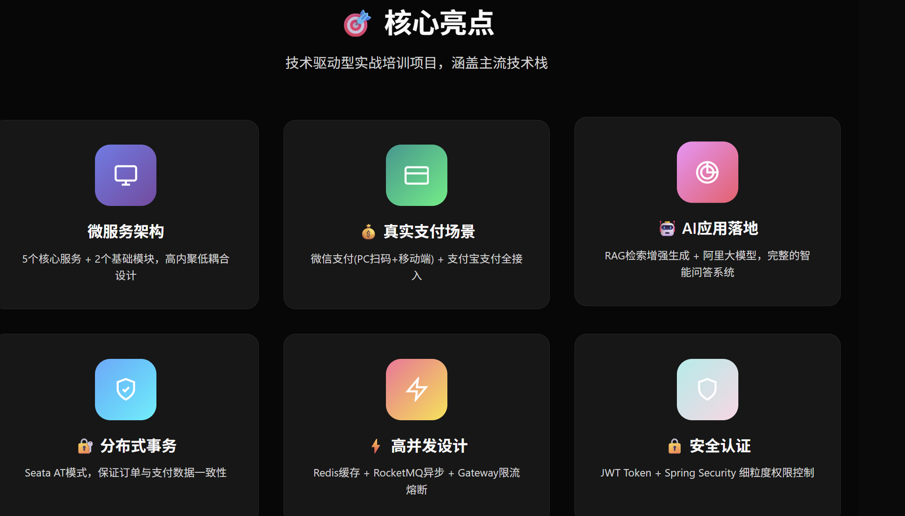
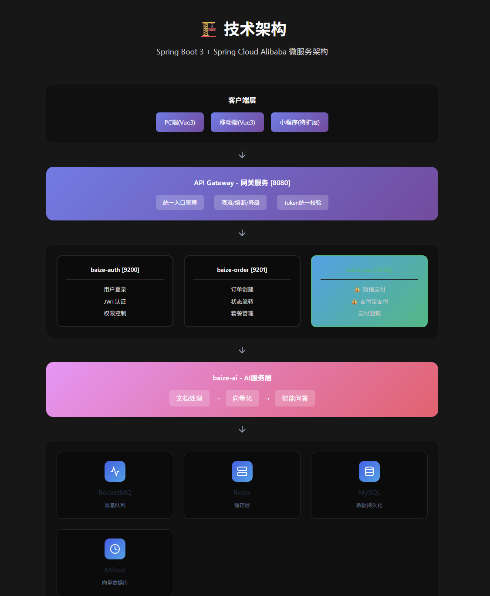

来个案例，想象你要开个餐厅客服系统。
市面上课程教你什么？直接GPT做后台回复客户消息，
顾客问：“发货了吗？” GPT现想：“亲，已发货哦”。
这叫玩具，200行代码，能跑通，发朋友圈，自我感动。
但企业能用吗？不能。
高峰期100个顾客同时问，GPT累瘫、响应慢，
还记错价格出现幻觉，一上线就崩。
这叫摆摊，不是开连锁店。
企业级项目长什么样？
第一步，先做菜单（意图识别）。顾客张嘴先判断：
他是问价格？要投诉？还是找经理？
不问GPT，用规则引擎做毫秒级响应，把顾客分流。
第二步，搞个智能配菜员（RAG）。
RAG = 只按你店里食材和菜单，自动帮顾客搭配的AI，
不是现想菜谱，是查后厨数据库。
顾客问：“昨天订单呢？” 配菜员去向量数据库查找。
但这里坑很深，东西太多找得慢怎么办？
常用菜放前面做缓存优化，
找不到时知道说“没有”做幻觉检测，这才叫工程化。
第三步，真正的手脚（工具调用）。

顾客说：“退款”，不是回一句“好的亲”，
是真操作POS机调用ERP接口，把订单改成“退款中”。
这需要API鉴权、幂等防重复退款、超时重试机制，
这些业务逻辑，Demo教学根本不提。
第四步，老板监控系统。
你要知道今天接待多少人（QPS监控），
AI懵了说胡话（幻觉报警），前台排队太长（限流熔断），
出事了能一键恢复（回滚）。
现在懂了吗？
代码量对比：玩具200行，企业级3800行核心+运维脚本。
差距不在API调用，而在架构思维与工程化能力。
一句话总结：别人教你摆摊，我教你开一整套连锁餐厅。
3个月，2～3个真·生产级企业项目，
共计156W+行代码【含Java、JS、配置、JSON及SQL等】。
全套工程化硬实力，学完简历能炸场，面试能乱杀。
大龄、应届生、零基础，我都能带出来拿高薪offer。
这就是我能带给你的东西。
真正的企业级项目到底长啥样？
是能直接丢生产环境跑的，是大厂同款架构，
是面试官一看到眼睛都亮的那种。
它像一整套餐厅体系：
有迎宾、点菜、记忆、后厨调度、做菜标准、
传菜流程、结账售后、老板监控大屏。
对应到大模型就是一整套：
【网关+限流熔断】【上下文+长短记忆】
【模型路由+调度降级】【幻觉控制+RAG】
【工具调用+业务闭环】【监控告警+运维回滚】
这一套，才叫能上线、能扛量、能写简历、能过面试。
重点来了——我们到底带你做什么？我今天把话往死里说。
我们不搞垃圾Demo，扎扎实实带你做2～3个生产级项目。
第一个：企业智能客服——可支撑3万日活。
大部分客服只是简单功能调用，我们对标日活3万线上系统，
包含完整记忆体系、模型路由、工具调用、监控部署，
能对接订单、物流、售后，企业改改配置直接上线。
学习中我们也提供快速版本，让你立即上手。
第二个：微服务AI文档分析平台。
7大服务模块，接入真实支付场景，
含分布式事务，多组件优化支持高并发，完全可商用。
第三个：业务数据问答Agent。
自动查库、出报表、做分析，
带权限控制、任务状态机、异常兜底。
我跟你说个扎心数字：
别人200行代码毕业，
我们18000行核心代码+4000行运维脚本，这才是企业真实门槛。
每一个项目，都能吊打市面上80%的简历。
我们和培训机构的区别，我今天把话放这：
别人教你：调接口、跑Demo、能聊天就行，
不管上线、工程化、面试，纯割韭菜，学完你啥也不是。
我们教你：一整套大厂级架构，
限流、记忆、路由、幻觉、工具调用、监控、部署，
全揉进项目里。你真写过、踩过坑、能讲、能扛深挖。
我们给你一整套冲大厂的本事。
最关键的：我怎么带你找工作？我一步一步带你。
第一，简历我给你从头改到脚。
项目怎么写、技术栈怎么堆、亮点怎么炸，
让HR第一眼就想约你面试。
第二，面试我逐题带你模拟。
大模型基础、工程化场景、系统设计、项目深挖、压力面，
我全给你练到滚瓜烂熟。
第三，我教你投简历、挑公司、避坑，

不被小作坊坑，不被低价压榨。
第四，我教你怎么谈薪、怎么要价。
刚才分享了项目，好多人想自学，自学会有什么坑点？
第一坑：学的全是旧的。
AI变化太快，B站教程半年前API早就不能用，
接口变、参数改，跟着敲全报错，根本跑不通，学了也白学。
第二坑：支离破碎。
网上项目全是广告，没代码只有二维码，
东学向量库，西学Prompt技巧，今天Java明天JS，学的拼不起来。
限流怎么搞？监控怎么布？没人告诉你，知识完全不成体系。
第三坑：跑Demo自我感动。
5行代码跑通、能聊天，发朋友圈以为掌握大模型。
其实这只是玩具，只解决单一问题：问天气、查时间。
就像餐厅客服例子，企业要处理高峰期100人同时问，
上下文记忆不丢失、退款不重复、幻觉拦截、监控实时。
这些复杂场景Demo里根本没有，200行代码遇真问题直接傻眼。
记住一句话：
应用型技术看场景，革命性技术看创新。
大模型、Transformer、神经网络是革命性的，取决于科学家创新。
但应用层完全取决于场景与业务，没有业务的Demo只是玩具。
学不到有灵魂的东西，浪费时间还损失自信。
今年入行不了，明年肯定更难，
一堆因AI失业的人，都在冲击大模型开发岗位。
你该学什么？60天入行AI大模型
🚀 第一个月：核心能力构建期
目标把Spring AI地基打牢，做出像样AI应用。
● 第1周：生态初探
跑通第一个AI应用，成功和AI对话，
搭项目架子，学会ChatClient，配置调用第一个AI模型。
● 第2周：模型驾驭
灵活切换多模型，实现Function Calling调用外部工具，
接入OpenAI、国产、本地模型，写动态切换服务。
● 第3周：记忆管家
做出有记忆客服Demo，记住用户对话历史，
用ChatMemory、MessageHistory，Redis做持久化。
● 第4周：RAG核心
从零搭建PDF文档问答助手，
理解RAG流程，处理文档转向量，用向量库实现检索。
🔥 第二个月：进阶与项目交付期
搞定智能体、多模态，做两个以上企业项目。
● 第5周：智能体入门
做出能规划、能用工具的Agent，
理解工作流，使用Spring AI Agent框架，实现多工具协调。
● 第6周：多模态扩展
让应用能看会说，集成图片、语音、文生图，
实现多模态理解、语音识别与合成。
● 第7周：投产准备
防提示词注入、安全加固，
Docker打包部署云服务器，配监控、健康检查。
● 第8周：综合实战
融合所有技术，独立交付企业级项目，
全链路设计，串联RAG、Agent、记忆、安全，整理面试宝典。
两个月学习+至少两个项目实战，你具备企业开发能力，再冲面试。
每一个项目拿出去，都能吊打市面上 80% 的简历。
我们和培训机构的区别，我今天把话放这里：
别人教你的只是调接口、跑 Demo、能聊天就完事，不管上线、不管工程化、不管面试，
纯纯割韭菜，学完你啥也不是，根本无法应对真实企业场景。
我们教你的是一整套大厂级架构体系，包括限流、记忆、路由、幻觉、工具调用、监控、部署，
全部揉进真实项目里，你真写过、真踩过坑、真能讲，完全能扛住面试官的深度追问。
最关键的是，我怎么带你找工作？我不玩虚的，
最关键的是，我怎么带你找工作？我不玩虚的，一步一步带你，只讲真实发生过的事情。
关于我们的服务
第一，简历我给你从头改到脚，项目怎么写、技术栈怎么堆、亮点怎么炸，怎么让 HR 第一眼看到就想约你面试。
第二，面试我逐题带你模拟，大模型基础、工程化场景、系统设计、项目深挖、压力面，我全部给你练到滚瓜烂熟。
第三，我教你怎么投简历、怎么挑公司、怎么避坑，不让你被小作坊坑，不让你被低价压榨。
第四，我教你怎么谈薪、怎么要价、怎么不被压价，怎么把你的项目价值，换成真金白银的高薪。
我手里有太多真实成功案例：
35 + 大龄转行零基础，4 个月上岸，总包 35 万 +。双非应届生没经验，靠这套项目进大厂外包转正式。

